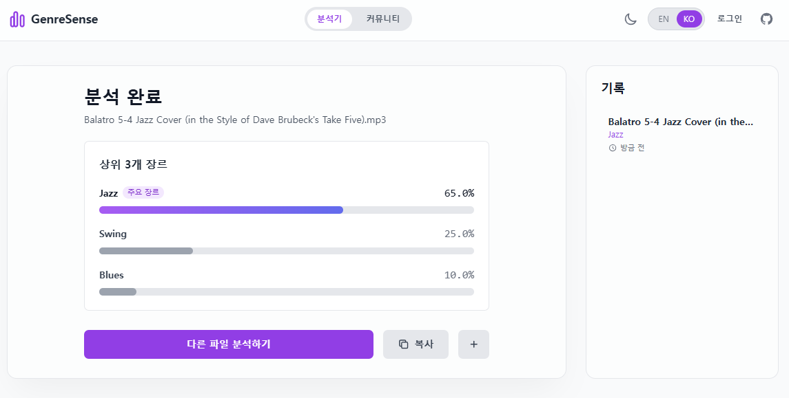
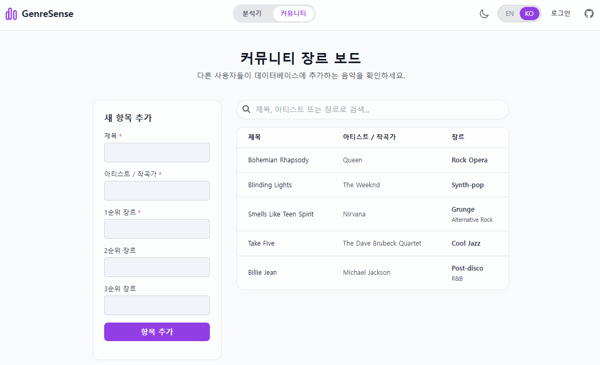

# GenreSense

Google AI Studio를 활용한 목업입니다. 분석 기능은 사용 가능합니다.

## 기존 환경의 문제점

Tunebat 등 음악의 메타데이터를 검색하는 사이트는 기존에도 존재했으나, 정작 음악의 장르에 대해서는 표기하지 않거나 있더라도 애매하고 포괄적인 경우가 많았음.

본 시스템은 장르 구분의 문제를 AI로 해결하는데 목적이 있음.

## 사용자

주로 음악 관련 종사자, 특히 장르 레퍼런스가 필요할 때

## 아이디어, 핵심 기능

본 서비스는 음악의 장르를 구하고, 이를 DB로 공유하는 플랫폼을 목적으로 함.

1. 음악 분석: AI를 활용한 음악 장르 분석

2. 결과 공유: 분석 결과를 즉시 DB로 전송

3. 커뮤니티 작성: 사용자가 직접 음악의 메타데이터를 작성해 DB로 전송

4. 검색: 사용자가 DB를 검색해 원하는 정보를 취득

5. 모바일 퍼스트 디자인: 데스크탑 외에서 접근성 완화

## 서비스 흐름

1. 업로드: 분석기에 파일을 업로드(직접 선택, 파일 드래그)

2. 작성: 결과를 바로 등록하거나, 커뮤니티에서 직접 작성

3. 검색: DB에서 원하는 정보를 검색

## AI 요소

Google Gemini API를 활용(혹은 멀티모달을 지원하는 다른 모델)

- 오디오 데이터 변환: 사용자가 업로드한 오디오 파일(MP3, WAV 등)을 클라이언트에서 Base64 형식의 문자열로 인코딩

- 멀티모달(Multimodal) 요청: 변환된 오디오 데이터와 함께, 장르 분석을 지시하는 텍스트 프롬프트를 Gemini 모델에 동시에 전송, 모델은 오디오를 직접 듣고 내용을 이해 가능

- 정교한 프롬프트 지시: AI에게 음악 장르 분류 전문가라고 역할을 부여하고, "상위 3개 장르를 확률과 함께 JSON 형식으로만 응답하세요."라고 매우 구체적으로 지시

- JSON 스키마를 통한 출력 제어: Gemini API의 responseSchema 기능 -> AI가 반드시 정해진 JSON 구조({ "top3": [...] })에 맞춰 응답하도록 강제해 응답 데이터의 형식이 깨지는 것을 방지하고 안정적으로 결과를 파싱 가능

## 기술 스택

1. 프론트엔드
   React, Tailwind CSS

2. 백엔드
   Google Gemini API 직접 호출, MongoDB

3. 디자인
   Figma(예정)

4. AI 요소
   Google Gemini 2.5 Flash(음악 인식)

5. 배포 환경
   Netlify 자동 배포(예정)

## 유료화 아이디어

1. 일간 음악 분석 횟수 무제한

2. Pro 기능

   - 추가로 곡의 분위기(Mood), BPM(분당 비트 수), 조성(Key), 사용된 악기(Instrumentation) 등 훨씬 상세한 데이터를 제공
   - 무료 버전의 10분 제한을 없애고, 믹스셋이나 팟캐스트 같은 긴 오디오 파일 분석을 지원합니다.
   - Batch 분석 (일괄 처리): 여러 개의 오디오 파일을 한 번에 업로드하여 동시에 분석하고 결과를 리포트로 받을 수 있는 기능입니다. 아티스트나 음반사에게 매우 유용한 기능이 될 수 있습니다.

3. 워크플로우 강화

   - 영구적인 분석 기록: 무료 버전은 최근 10개 기록만 저장되지만, 유료 버전은 모든 분석 기록을 영구적으로 계정에 저장하고 언제든 다시 확인할 수 있습니다.
   - 클라우드 연동: Google Drive, Dropbox 등 개인 클라우드 스토리지에 있는 음원 파일을 직접 불러와 분석할 수 있습니다.
   - 데이터 내보내기: 분석 결과나 커뮤니티 데이터를 CSV 또는 JSON 파일 형태로 다운로드할 수 있는 기능을 제공합니다.

## 기대 효과, 향후 계획

일반 사용자가 사용해도 좋지만, 주로 음악 관련 종사자가 빠르게 레퍼런스 노선을 잡는 용도로 사용되었으면 좋겠음.

음악 분석 관련 서비스가 대체로 웹으로만 작동하기 때문에, 차별화를 위해서 모바일 앱과 스피커를 통한 실시간 인식 기능이 추가되어야 할 것.

## 팀 정보

개인

# Run and deploy your AI Studio app

This contains everything you need to run your app locally.

View your app in AI Studio: https://ai.studio/apps/drive/1vT-aSQ2GS3fpcHfP0PzfZneb-l-aWk89

## Run Locally

**Prerequisites:** Node.js

1. Install dependencies:
   `npm install`
2. Set the `GEMINI_API_KEY` in [.env.local](.env.local) to your Gemini API key
3. Run the app:
   `npm run dev`
